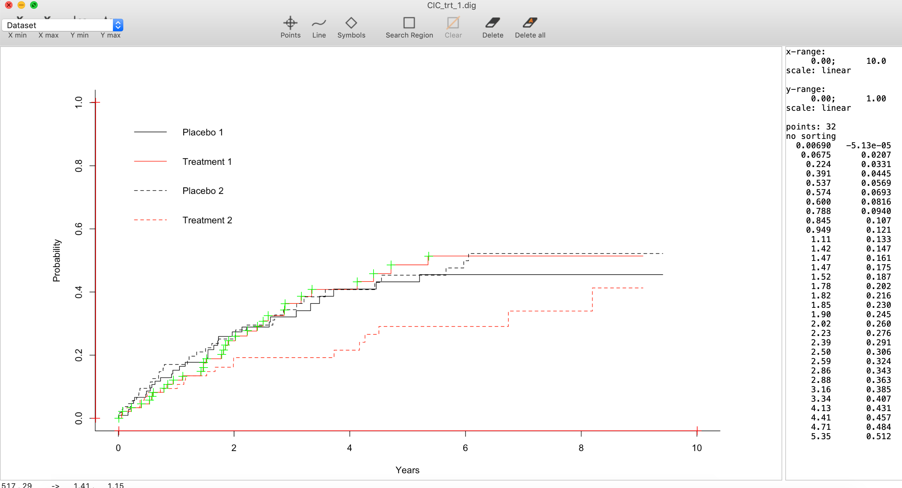
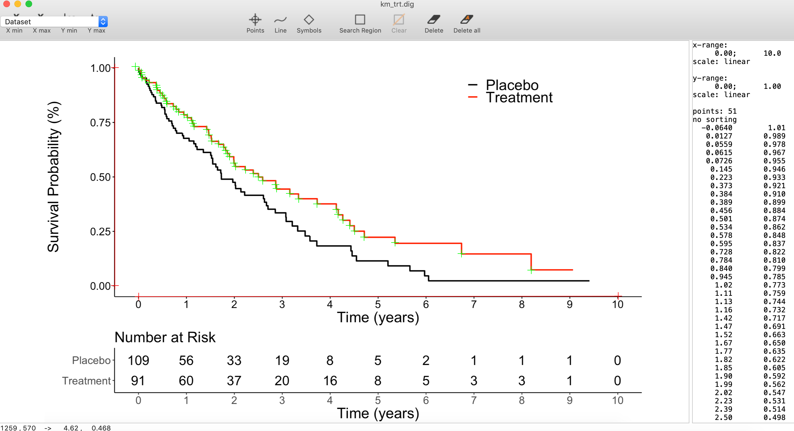

```{r setup, include=FALSE}
knitr::opts_chunk$set(echo = TRUE)
library(dplyr)
library(magrittr)
library(survival)
library(survminer)
library(devtools)
library(reconstructKM)
install_github("ryanrsun/reconstructKM")
```

## Introduction

This vignette will walk through an example of how to use the functionality in 
reconstructKM. We will:
    1. Simulate competing risks data
    2. Visualize the data with KM curves and cumulative incidence curves
    3. Reconstruct the data using only the visualizations

If you are only interested in reconstructing the KM curve, just skip the sections
pertaining to the cumulative incidence functions.

# Simulate data
Suppose we have two groups of subjects, call them treatment and control. Suppose also that we are interested in two competing events, call them cancer progression and death. We simulate times to these events, with better progression-free survival (PFS) in the treatment group. 

```{r sim data, echo = TRUE}

set.seed(2)
n <- 200
# placebo group survival time for each outcome is exponential with mean 5, 
# treatment group survival time for each outcome is exponential with mean 17.
true_IPD <- data.frame(arm = factor(sample(1:2,n,replace=TRUE),
                                    1:2,c("Placebo", "Treatment"))) %>%
    mutate(lambda = ifelse(arm == "Placebo", 1/5, 1/7)) %>% 
    mutate(time1 = rexp(n=n, rate = lambda)) %>%
    mutate(time2 = rexp(n=n, rate = lambda)) %>%
    mutate(cens_time = rexp(n=n, rate = 1/5)) %>%
    mutate(event_time = ifelse(time1 < time2, time1, time2)) %>%
    mutate(obs_time = ifelse(event_time < cens_time, event_time, cens_time)) %>%
    mutate(status = ifelse(cens_time < event_time, 0, 1)) %>%
    mutate(type = ifelse(time1 < time2, 1, 2)) %>%
    mutate(type = ifelse(cens_time < event_time, 0, type))

```

# Visualize
Now let's visualize the data. Use the cmprsk package to plot the cumulative incidence functions of the two events in the two groups. Then plot the standard Kaplan-Meier curve of PFS, where death and progression are combined into a composite event:

```{r visualize, echo = FALSE, fig.width=7, fig.height=5}
# no strata (i.e. covariates like sex) variable
xx <- cmprsk::cuminc(ftime = true_IPD$obs_time, fstatus = true_IPD$type,
                     group = true_IPD$arm)

# plot cumulative incidence curves
plot(xx,lty=c(1,1,2,2),color=c(1,2,1,2), xlim=c(0, 10))
cat('\n')

# plot KM
KM_fit <- survfit(Surv(obs_time, status) ~ arm, data=true_IPD)
KM_plot <- ggsurvplot(KM_fit, data = true_IPD, risk.table = TRUE, 
                        palette=c('black', 'red'), censor.shape='',
           legend=c(0.75,0.9), legend.title='',legend.labs=c('Placebo', 'Treatment'),
           title='',
           ylab='Survival Probability (%)', xlab='Time (years)', tables.y.text=TRUE,
           tables.y.text.col=FALSE, risk.table.title='Number at Risk', break.time.by=1,
           censor=TRUE, font.x=22, font.y=22, font.tickslab=16, font.legend=22, 
           font.subtitle=20, font.caption=20, risk.table.fontsize=7,
           tables.theme = theme_survminer(font.main = 22, font.y=22,
                                          font.x=22, font.tickslab=16))
KM_plot
```

```{r csv to rda, echo=FALSE, eval=FALSE}
# read in the CSVs provided by digitizeIt and save them as rda
km_trt_clicks <- read.csv('km_trt_data.csv') %>%
    as.data.frame(.) %>%
    set_colnames(c('time', 'survival')) 
km_trt_clicks[1, ] <- c(0, 1)
save(km_trt_clicks, file="km_trt_clicks.rda")

km_pbo_clicks <- read.csv('km_pbo_data.csv') %>%
    as.data.frame(.) %>%
    set_colnames(c('time', 'survival')) 
km_pbo_clicks[1, ] <- c(0, 1)
save(km_pbo_clicks, file="km_pbo_clicks.rda")

cic_trt1_clicks <- read.csv('CIC_trt_1_data.csv') %>%
    as.data.frame(.) %>%
    set_colnames(c('time', 'est_cum_inc')) 
cic_trt1_clicks[1, ] <- c(0, 0)
save(cic_trt1_clicks, file="cic_trt1_clicks.rda")

cic_trt2_clicks <- read.csv('CIC_trt_2_data.csv') %>%
    as.data.frame(.) %>%
    set_colnames(c('time', 'est_cum_inc')) 
cic_trt2_clicks[1, ] <- c(0, 0)
save(cic_trt2_clicks, file="cic_trt2_clicks.rda")

cic_pbo1_clicks <- read.csv('CIC_pbo_1_data.csv') %>%
    as.data.frame(.) %>%
    set_colnames(c('time', 'est_cum_inc')) 
cic_pbo1_clicks[1, ] <- c(0, 0)
save(cic_pbo1_clicks, file="cic_pbo1_clicks.rda")

cic_pbo2_clicks <- read.csv('CIC_pbo_2_data.csv') %>%
    as.data.frame(.) %>%
    set_colnames(c('time', 'est_cum_inc')) 
cic_pbo2_clicks[1, ] <- c(0, 0)
save(cic_pbo2_clicks, file="cic_pbo2_clicks.rda")

trt_NAR <- data.frame(time=0:10, NAR=c(91, 60, 37, 20, 16, 8, 5, 3, 3, 1, 0))
pbo_NAR <- data.frame(time=0:10, NAR=c(109, 56, 33, 19, 8, 5, 2, 1, 1, 1, 0))
save(trt_NAR, file="trt_NAR.rda")
save(pbo_NAR, file="pbo_NAR.rda")
```

# Reconstruct

Now we will use only these two plots to recreate the individual-level data.
We have to use a digitizer software to record the "jumps" in each curve.

For example:

{width=500px}

{width=500px}

The full click data and number at risk tables can be loaded as shown below, so you don't actually have to do the clicking yourself. We can then use the package functions to reconstruct the PFS data (without splitting by event type initially).

```{r reconstruct, eval=TRUE, results='show', warning=FALSE}
data("km_trt_clicks")
data("km_pbo_clicks")
data("trt_NAR")
data("pbo_NAR")

# augment
trt_aug <- format_raw_tabs(raw_NAR=trt_NAR,
                                  raw_surv=km_trt_clicks) 
pbo_aug <- format_raw_tabs(raw_NAR=pbo_NAR,
                                  raw_surv=km_pbo_clicks) 

# reconstruct KM only
trt_recon <- KM_reconstruct(aug_NAR=trt_aug$aug_NAR, aug_surv=trt_aug$aug_surv)
pbo_recon <- KM_reconstruct(aug_NAR=pbo_aug$aug_NAR, aug_surv=pbo_aug$aug_surv)
```


Now you have the reconstructed dataset and can check its veracity, for example by reconstructing the KM plots.

```{r reconstruct KM, eval=TRUE, results='show', fig.width=7, fig.height=5, warning=FALSE}

# put the treatment and control arms into one dataset
trt_IPD <- data.frame(arm=1, time=trt_recon$IPD_time, status=trt_recon$IPD_event)
pbo_IPD <- data.frame(arm=0, time=pbo_recon$IPD_time, status=pbo_recon$IPD_event)
recon_IPD <- rbind(trt_IPD, pbo_IPD)

# plot
recon_KM_fit <- survival::survfit(survival::Surv(time, status) ~ arm, data=recon_IPD)
recon_KM <- survminer::ggsurvplot(recon_KM_fit, data = recon_IPD, risk.table = TRUE, 
                        palette=c('black', 'red'),
           legend=c(0.86,0.9), legend.title='',legend.labs=c('Placebo', 'Treatment'),
           title='Reconstructed',
           ylab='Survival Probability (%)', xlab='Time (years)',
           tables.y.text=TRUE,
           tables.y.text.col=FALSE, risk.table.title='Number at Risk', break.time.by=1,
           censor=TRUE, font.x=22, font.y=18, font.tickslab=16, font.legend=22, 
           font.subtitle=20, font.caption=20, risk.table.fontsize=7,
           tables.theme = survminer::theme_survminer(font.main = 22, font.y=22,
                                          font.x=22, font.tickslab=16))
recon_KM        
```


And then we can reconstruct and plot the reconstructed cumulative incidence curves using the cmprsk package:

```{r reconstruct CIC, eval=TRUE, results='show', fig.width=7, fig.height=5, warning=FALSE}
# load cic data
data("cic_trt1_clicks")
data("cic_trt2_clicks")
data("cic_pbo1_clicks")
data("cic_pbo2_clicks")

# reconstruct
trt_recon_IPD_aug <- CIC_reconstruct(IPD=trt_IPD, clicks1=cic_trt1_clicks, clicks2=cic_trt2_clicks)$IPD_aug
pbo_recon_IPD_aug <- CIC_reconstruct(IPD=pbo_IPD, clicks1=cic_pbo1_clicks, clicks2=cic_pbo2_clicks)$IPD_aug
recon_IPD_aug <- rbind(trt_recon_IPD_aug, pbo_recon_IPD_aug) %>%
    mutate(arm = ifelse(arm == 0, "Placebo", "Treatment"))

# plot cumulative incidence curves
yy <- cmprsk::cuminc(ftime = recon_IPD_aug$time, 
                     fstatus = recon_IPD_aug$type,
                     group = recon_IPD_aug$arm)
plot(yy,lty=c(1,1,2,2),color=c(1,2,1,2), xlim=c(0, 10), ylim=c(0,1),
     main="Reconstructed")

```

We can also see how far off our reconstructed cumulative incidence
estimates are:
```{r table difference, eval=TRUE, results='show', warning=FALSE}

# reconstructed cum inc estimates for trt event 1
trt1_tab_recon <- data.frame(time = yy$`Treatment 1`$time,
                       cuminc = yy$`Treatment 1`$est) %>%
    mutate(inc = c(0, diff(cuminc))) %>%
    filter(inc != 0)
# original cum inc for trt event 1
trt1_tab_orig <- data.frame(time = xx$`Treatment 1`$time,
                       cuminc = xx$`Treatment 1`$est) %>%
    mutate(inc = c(0, diff(cuminc))) %>%
    filter(inc != 0)

# reconstructed cum inc estimates for trt event 2
trt2_tab_recon <- data.frame(time = yy$`Treatment 2`$time,
                       cuminc = yy$`Treatment 2`$est) %>%
    mutate(inc = c(0, diff(cuminc))) %>%
    filter(inc != 0)
# original cum inc for trt event 2
trt2_tab_orig <- data.frame(time = xx$`Treatment 2`$time,
                       cuminc = xx$`Treatment 2`$est) %>%
    mutate(inc = c(0, diff(cuminc))) %>%
    filter(inc != 0)

cbind(trt1_tab_orig[1:20, 1:2], trt1_tab_recon[1:20, 1:2]) %>%
    set_colnames(c('Trt1 Time (orig)', 'Trt1 CI (orig)', 'Trt1 Time (recon)', 'Trt1 CI (recon)'))
cbind(trt2_tab_orig[1:20, 1:2], trt2_tab_recon[1:20, 1:2]) %>%
        set_colnames(c('Trt2 Time (orig)', 'Trt2 CI (orig)', 'Trt2 Time (recon)', 'Trt2 CI (recon)'))

```
